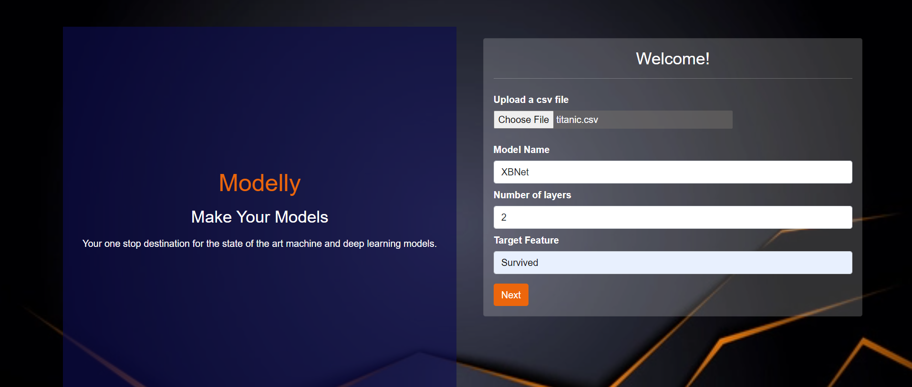
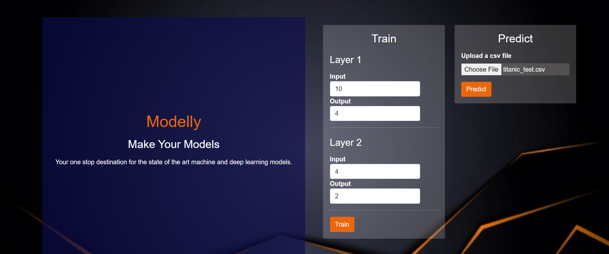
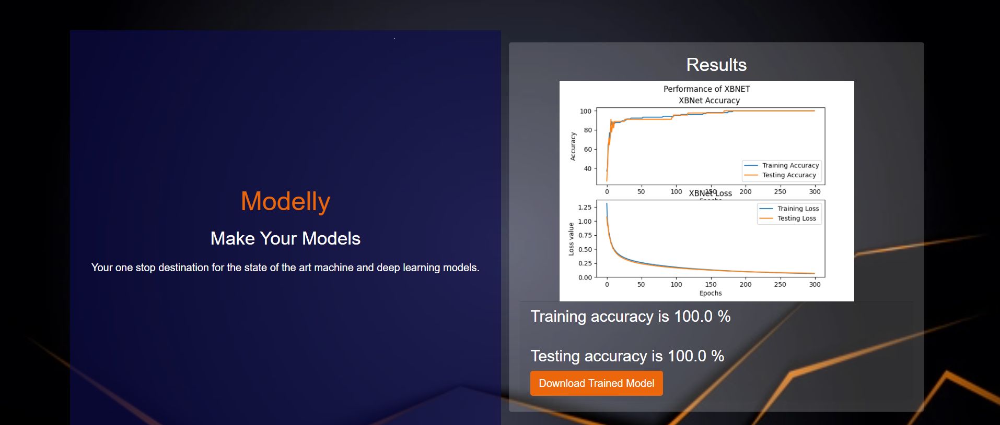

# Modelly 
## Your one stop destination for building state of the art machine and deep learning models.

[](https://pytorch.org/ "PyTorch")

Modelly is a no-code solution for building, training and inferring from your built models. It allows everyone to create their own model and 
training them by just selecting the dataset and the name of the required
 model. For purely non-technical professionals, it allows you to build 
and train models in such a way that no hyperparameters are required 
and you can easily use it in a hassle-free way. For technical 
professionals, it allows you to focus on the core architecture and 
hyperparameters without any coding requirements to build an optimal 
architecture.
---

## Features

- No prior coding experience/knowledge required.
- No data cleaning or pre-processing required.
- Robust solution for training as well as inference phase.
- Trained model and predicted outputs can be downloaded for future use.
- Easy and intuitive UI.
- Training characteristics are graphically represented.

---

## Currently usable models

- XBNet
- Deep Neural Network
- XGBoost
- Random Forest
- Light GBM
- Decision Tree

---

### To run this project :

Clone the project -
```
  $ git clone https://github.com/tusharsarkar3/Modelly.git
```
  
Start a new virtual environment -
```
  $ virtual venv
 ``` 

Install all the reqirements -
```
  $ pip install -r requirements.txt
 ``` 
Run the following commands -

``` 
  $ flask run
``` 

---
### Output images :

  

  


---

 #### Features to be added :
- Adding more models.
- Adding pre-trained models.

---

<h3 align="center"><b>Developed with :heart: by <a href="https://github.com/tusharsarkar3">Tushar Sarkar</a> and <a href="https://github.com/dishaShah01">Disha Shah</a>

